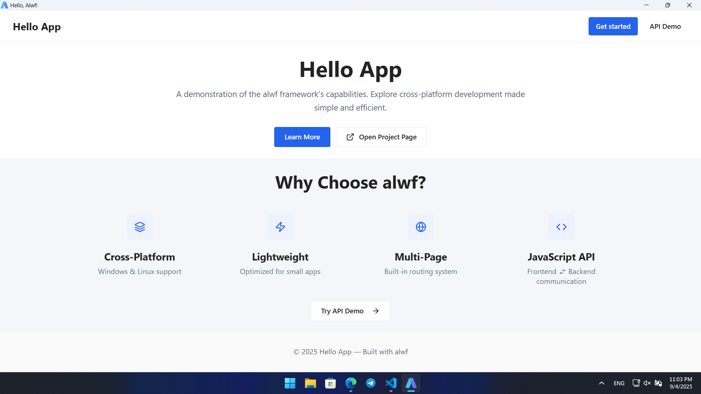
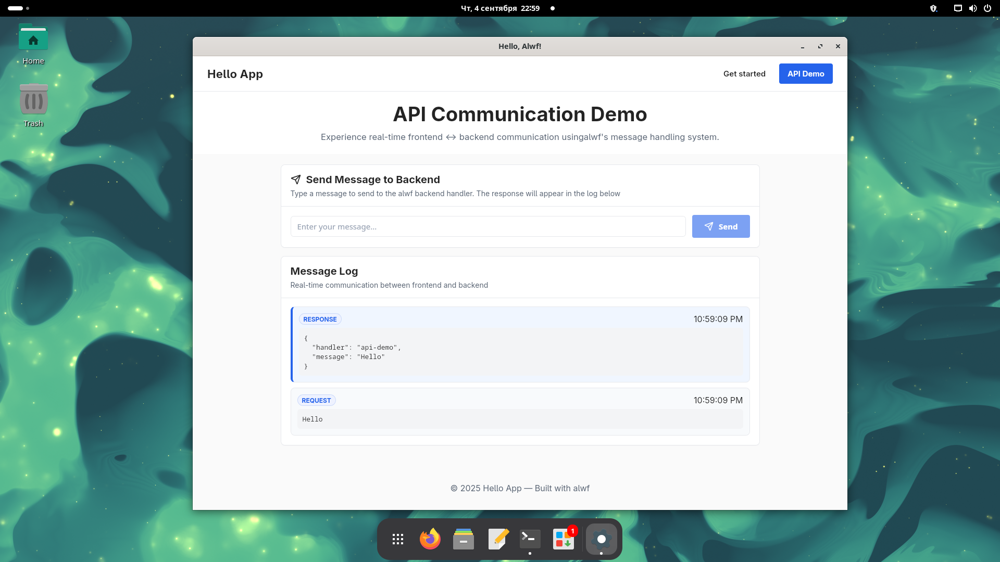

# App3D Little WebView Framework

**Alwf** is a lightweight cross-platform webview backend framework, developed as part of the App3D project.  
It is designed for quickly embedding HTML/CSS/JavaScript interfaces into native C++ applications, making it ideal for small utilities, demos, and tools that require tight OS integration without the complexity of large frameworks like Electron or CEF.  

The goal of alwf is not to provide a full-scale application platform, but to make it easy to connect a web-based frontend with a C++ backend for lightweight, focused use cases. You should not expect built-in support for unrelated services or integrations — instead, alwf focuses on the essentials for rapid development and deployment.

## Overview

With alwf, you can create applications where the UI is written in HTML/CSS/JS and the logic is implemented in C++.  
It offers a cross-platform API for messaging between the frontend and the backend, supports multi-page routing and event handling.  
Templates can be precompiled into C++ code at build time, allowing you to bundle your UI directly into the executable. 
You can handle events from JavaScript, send messages to the frontend, and open external resources via the system browser.  

## Features
- Cross-platform (Windows & Linux)
- Lightweight, minimal dependencies
- Cross-platform frontend-backend messaging
- Routing and external link handling
- Pug template precompilation into C++
- Event handler registration from JS
- Sending messages to JS
- Rapid integration via CMake

## Limitations
### SIMD Support
Applications built with **alwf** are compiled without SIMD support.  
The `acul-simd` module may still be built as part of the framework, but it is only required for internal tooling and is not used by alwf applications themselves.

### POST multipart Payload
On Windows there is a known issue with multipart payloads in WebView2  
([MicrosoftEdge/WebView2Feedback#2162](https://github.com/MicrosoftEdge/WebView2Feedback/issues/2162)).  
For the sake of cross-platform consistency, multipart payloads are not supported in alwf.

### Response status codes
By design, GTK WebView on Linux does not support setting HTTP response status codes.  
To unify the cross-platform interface, status codes are not set in alwf responses.

## Building
### Supported compilers:
- GNU GCC
- Clang

### Supported OS:
- Linux
- Microsoft Windows

### External packages
These are system libraries that must be available at build time:
- [RapidJSON](https://github.com/Tencent/rapidjson)
- [WebKitGTK](https://webkitgtk.org/) Linux Only
- [WebView2 SDK](https://developer.microsoft.com/en-us/microsoft-edge/webview2/)* Microsoft Windows Only

> [!NOTE]
> For Microsoft Windows, WebView2 linking is available only as shared library.
> The environment variable `WEBVIEW2_SDK_PATH` must be defined and points to the SDK root.  

### Bundled submodules
The following dependencies are included as git submodules and must be checked out when cloning:

- [acbt](https://github.com/app3d-public/acbt)
- [acul](https://github.com/app3d-public/acul)
- [awin](https://github.com/app3d-public/awin) Microsoft Windows only
- [ahtt](https://github.com/app3d-public/ahtt)

### Quick start
Follow these steps to scaffold and build a fresh app powered by **alwf**.

#### Initialize tooling
Run the setup script in the `alwf` repository.  
This pulls submodules and initializes the template compiler.

```sh
sh setup.sh
```

#### Project layout
```text
my_app/
├─ CMakeLists.txt
├─ src/            # source code
├─ views/          # .pug templates
├─ public/         # static assets (images/css/js)
├─ assets/         # app asset files
│  └─ icon.ico
└─ src/locales/    # optional i18n files
```

#### CMake configuration
Create a CMakeLists.txt and define the alwf variables before including alwf.cmake
```cmake
cmake_minimum_required(VERSION 3.17)
project(my_app VERSION 0.0.1 LANGUAGES CXX C)

# Path to alwf root
set(ALWF_ROOT_DIR ${CMAKE_CURRENT_SOURCE_DIR}/../alwf)
# Path to source code
set(ALWF_SOURCE_DIR ${CMAKE_CURRENT_SOURCE_DIR}/src)
# Path to pug templates
set(ALWF_VIEWS_DIR  ${CMAKE_CURRENT_SOURCE_DIR}/views)
# Path to static assets
set(ALWF_PUBLIC_DIR ${CMAKE_CURRENT_SOURCE_DIR}/public)
# App icon
set(ALWF_ICON         ${CMAKE_CURRENT_SOURCE_DIR}/assets/icon.ico)
# Path to locales (.po). It is the optional field
set(ALWF_LOCALES_SRC  ${CMAKE_CURRENT_SOURCE_DIR}/src/locales)

include(${ALWF_ROOT_DIR}/alwf.cmake)
```

## Example
An example project is available in [`example/`](example/) folder

<details>
  <summary>Screenshots</summary>
  <a href="https://github.com/app3d-public/alwf/blob/master/example/screenshots/windows-root.png">
    
  </a>
  <a href="https://github.com/app3d-public/alwf/blob/master/example/screenshots/linux-api.png">
    
  </a>
</details>

## License
This project is licensed under the [MIT License](LICENSE).

## Contacts
For any questions or feedback, you can reach out via [email](mailto:wusikijeronii@gmail.com) or open a new issue.